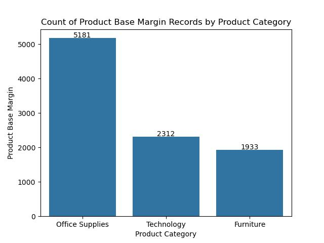
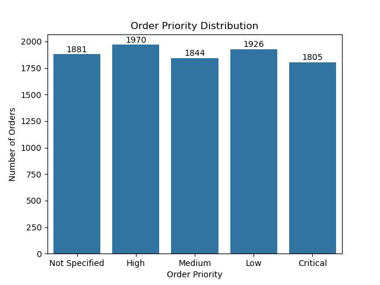
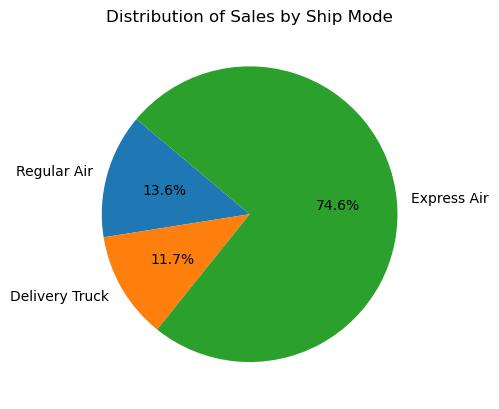
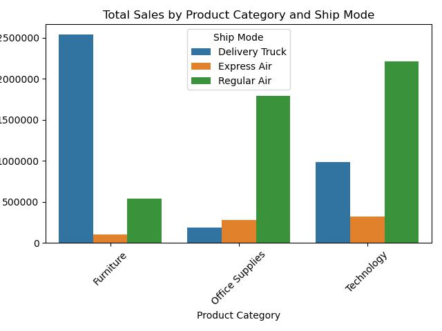
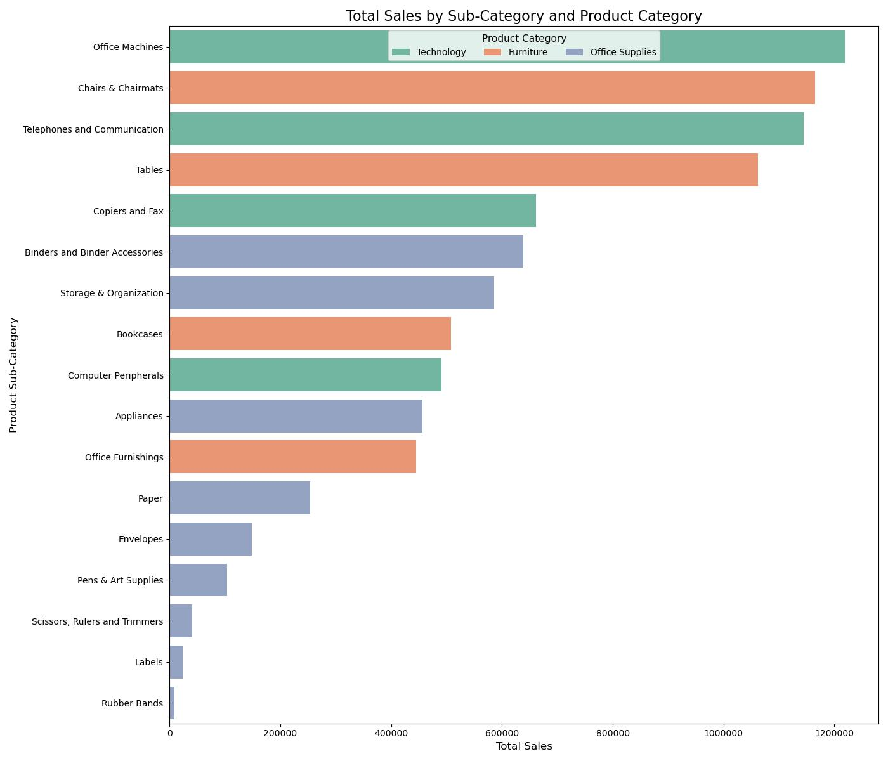
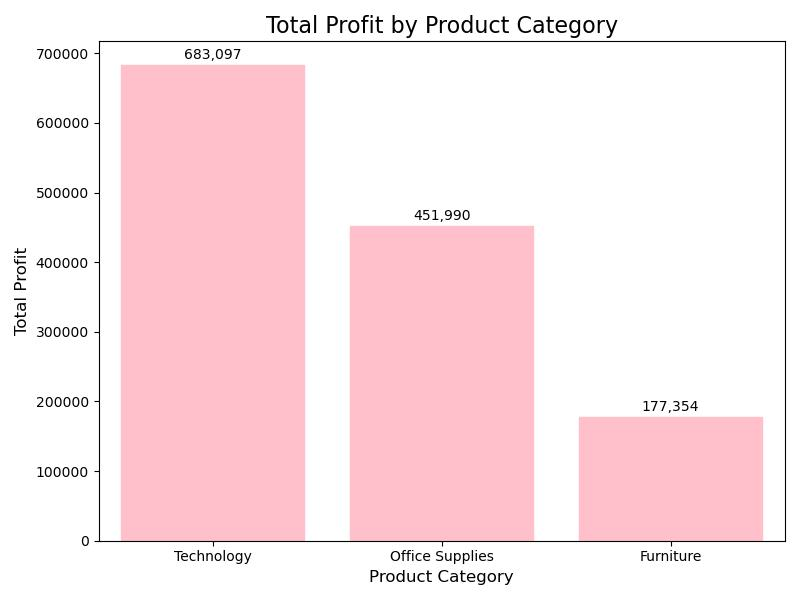
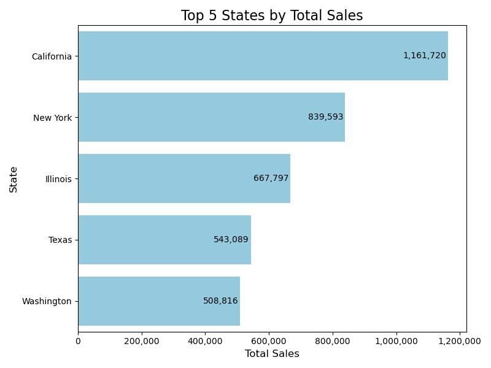

# 🛒 U.S.A. Superstore Sales Analysis Project

In this project, I analyzed the **U.S.A. Superstore Sales Dataset** to identify sales trends, customer behavior, shipping patterns, and regional insights. The analysis is supported by data visualizations to help drive better business decisions.

## 🎯 Project Objective

The objective of this project is to perform **data cleaning**, **exploratory analysis**, and **visualization** on the *Superstore Dataset* to:

- Understand **sales trends across product categories and shipping modes**
- Analyze **customer segments and order priorities**
- Explore **regional and yearly patterns** in sales and profit
- Reveal **key business drivers** using statistical visualizations

## 📂 Dataset Used

- **Name**: *U.S.A. Superstore Sales*
- **Records**: 9,426 entries
- **Attributes**:  
  `Row ID`, `Order Priority`, `Discount`, `Unit Price`, `Shipping Cost`, `Customer ID`,  
  `Customer Name`, `Ship Mode`, `Customer Segment`, `Product Category`, `Product Sub-Category`,  
  `Product Container`, `Product Name`, `Product Base Margin`, `Region`, `State or Province`, `City`,  
  `Postal Code`, `Order Date`, `Ship Date`, `Profit`, `Quantity ordered new`, `Sales`, `Order ID`
- **Source**: <a href="https://github.com/VikasSharma0052/U.S.A-Superstore-Sales-Analysis/blob/main/Superstore_USA.xlsx">Provided Dataset File</a>

## ❓ Key Questions (KPIs)

1. 🔝 What is the **distribution of orders by priority**?
2. 🚚 Which **shipping mode** is used most frequently?
3. 👤 Which **customer segment** contributes most to sales?
4. 📦 How do **product categories and shipping modes** affect sales?
5. 🧾 Which **product sub-categories** generate the highest sales within each category?
6. 📈 What is the **trend of orders over the years**?
7. 💰 Which **product category yields the most profit**?
8. 🏆 Which **states have the highest sales**?
9. 🧮 How is the **Product Base Margin** distributed across product categories?

## ⚙️ Process Followed

1. 🧹 **Data Cleaning**:
   - Checked for **null values** and handled missing values in `Product Base Margin` using mean imputation.
   - Verified and confirmed **no duplicate records** in the dataset.

2. 📊 **Exploratory Data Analysis**:
   - Conducted descriptive statistical analysis
   - Grouped and aggregated data using `groupby()` to extract business insights

3. 📈 **Visualization**:
   - Created various charts using:
     - `Matplotlib`
     - `Seaborn`
     - `Pandas`
     - `NumPy`

## 📸 Visualizations

### 1️⃣ Count of Product Base Margin Records by Product Category

### 2️⃣ Order Priority Distribution

### 3️⃣ Distribution of Sales by Ship Mode

### 5️⃣ Total Sales by Product Category and Ship Mode

### 6️⃣ Total Sales by Sub-Category and Product Category

### 7️⃣ Trend of Number of Orders Per Year

### 8️⃣ Total Profit by Product Category

### 9️⃣ Top 5 States by Total Sales

## 🧠 Project Insights

1. 📦 **Order Priority Distribution**:
   - The **High** order priority accounts for the maximum with **1,970 orders**.

2. 🚛 **Shipping Mode**:
   - **Express Air** is the most frequently used shipping method with **74.6%** usage.

3. 👨‍💼 **Customer Segment**:
   - The **Corporate** segment leads with **3,375 orders**.

4. 📊 **Sales by Product Category and Ship Mode**:
   - **Furniture** is majorly shipped via **Delivery Truck**
   - **Office Supplies** and **Technology** are mostly shipped via **Regular Air**

5. 🗂️ **Sales by Sub-Category and Category**:
   - **Technology → Office Machines**
   - **Furniture → Chairs & Chairmats**
   - **Office Supplies → Binders and Binder Accessories** are top-selling combinations

6. 📈 **Order Trends**:
   - Orders **increased every year**, peaking in **2013** with **3,054 orders**

7. 💹 **Profit by Product Category**:
   - **Technology** is the most profitable category with **$683K** in profit

8. 🌎 **Top 5 States by Sales**:
   - **California** leads with the highest sales of **$1,161K**

9. 🧾 **Product Base Margin Records**:
   - The highest margin count is in **Office Supplies** with **5,181 entries**

---

## ✅ Final Conclusion

The analysis of the U.S.A. Superstore Sales dataset reveals several valuable business insights. It is evident that corporate customers form the largest customer segment, and Express Air is the most widely used shipping method, indicating a preference for faster delivery. Among the product categories, Technology emerges as the most profitable, while Office Machines and Binders contribute significantly to overall sales. Regionally, California dominates in total sales, positioning it as a key market for business focus. Additionally, the number of orders has shown a consistent year-over-year increase, peaking in 2013, highlighting growing customer engagement. These findings suggest that by focusing on high-performing product categories, optimizing shipping strategies, and strengthening operations in top-performing regions, businesses can enhance customer satisfaction and drive significant revenue growth.
